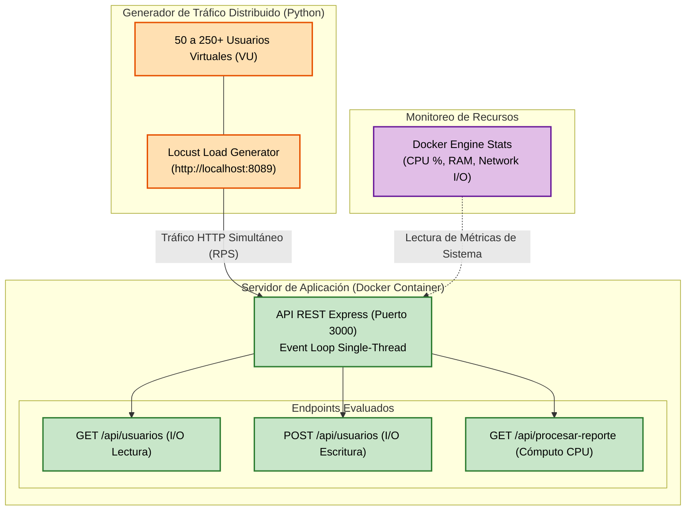

```mermaid
flowchart TD
    subgraph Capa_Generacion ["Generador de Tráfico Distribuido (Python)"]
        Locust["Locust Load Generator<br/>(http://localhost:8089)"]
        Users["50 a 250+ Usuarios Virtuales (VU)"]
        Users --- Locust
    end

    subgraph Capa_Monitoreo ["Monitoreo de Recursos"]
        DockerStats["Docker Engine Stats<br/>(CPU %, RAM, Network I/O)"]
    end

    subgraph Capa_Backend ["Servidor de Aplicación (Docker Container)"]
        Express["API REST Express (Puerto 3000)<br/>Event Loop Single-Thread"]
        
        subgraph Endpoints ["Endpoints Evaluados"]
            EP1["GET /api/usuarios (I/O Lectura)"]
            EP2["POST /api/usuarios (I/O Escritura)"]
            EP3["GET /api/procesar-reporte (Cómputo CPU)"]
        end

        Express --> EP1
        Express --> EP2
        Express --> EP3
    end

    %% Conexiones
    Locust -- "Tráfico HTTP Simultáneo (RPS)" --> Express
    DockerStats -. "Lectura de Métricas de Sistema" .-> Express

    %% Estilos con texto negro explícito (legible en Dark y Light mode)
    classDef genStyle fill:#FFE0B2,stroke:#E65100,stroke-width:2px,color:#000000;
    classDef monStyle fill:#E1BEE7,stroke:#6A1B9A,stroke-width:2px,color:#000000;
    classDef appStyle fill:#C8E6C9,stroke:#2E7D32,stroke-width:2px,color:#000000;

    class Locust,Users genStyle;
    class DockerStats monStyle;
    class Express,EP1,EP2,EP3 appStyle;
```