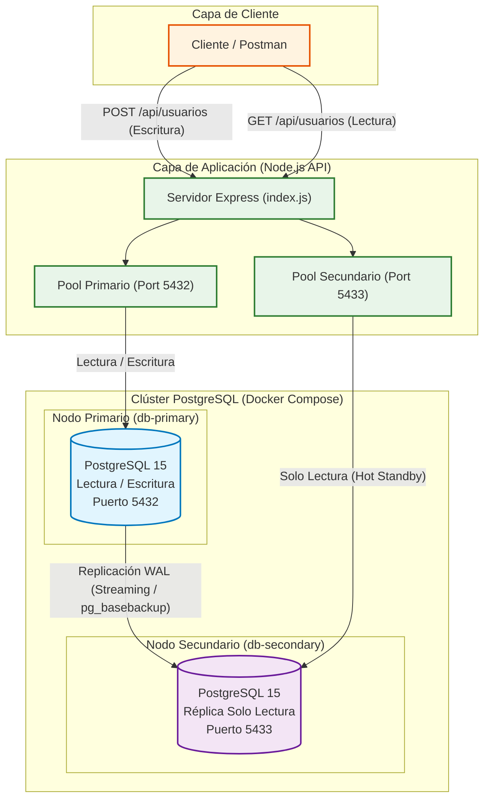

```mermaid
flowchart TD
    subgraph Capa_Cliente ["Capa de Cliente"]
        Cliente["Cliente / Postman"]
    end

    subgraph Capa_Aplicacion ["Capa de Aplicación (Node.js API)"]
        Backend["Servidor Express (index.js)"]
        PoolP["Pool Primario (Port 5432)"]
        PoolS["Pool Secundario (Port 5433)"]
        
        Backend --> PoolP
        Backend --> PoolS
    end

    subgraph Cluster_Docker ["Clúster PostgreSQL (Docker Compose)"]
        subgraph DB_Primary_Node ["Nodo Primario (db-primary)"]
            DB_Primary[("PostgreSQL 15<br/>Lectura / Escritura<br/>Puerto 5432")]
        end

        subgraph DB_Secondary_Node ["Nodo Secundario (db-secondary)"]
            DB_Secondary[("PostgreSQL 15<br/>Réplica Solo Lectura<br/>Puerto 5433")]
        end

        DB_Primary -- "Replicación WAL (Streaming / pg_basebackup)" --> DB_Secondary
    end

    %% Conexiones
    Cliente -- "POST /api/usuarios (Escritura)" --> Backend
    Cliente -- "GET /api/usuarios (Lectura)" --> Backend

    PoolP -- "Lectura / Escritura" --> DB_Primary
    PoolS -- "Solo Lectura (Hot Standby)" --> DB_Secondary

    %% Estilos
    classDef clientStyle fill:#fff3e0,stroke:#e65100,stroke-width:2px;
    classDef appStyle fill:#e8f5e9,stroke:#2e7d32,stroke-width:2px;
    classDef primaryStyle fill:#e1f5fe,stroke:#0277bd,stroke-width:2px;
    classDef secondaryStyle fill:#f3e5f5,stroke:#6a1b9a,stroke-width:2px;

    class Cliente clientStyle;
    class Backend,PoolP,PoolS appStyle;
    class DB_Primary primaryStyle;
    class DB_Secondary secondaryStyle;
```