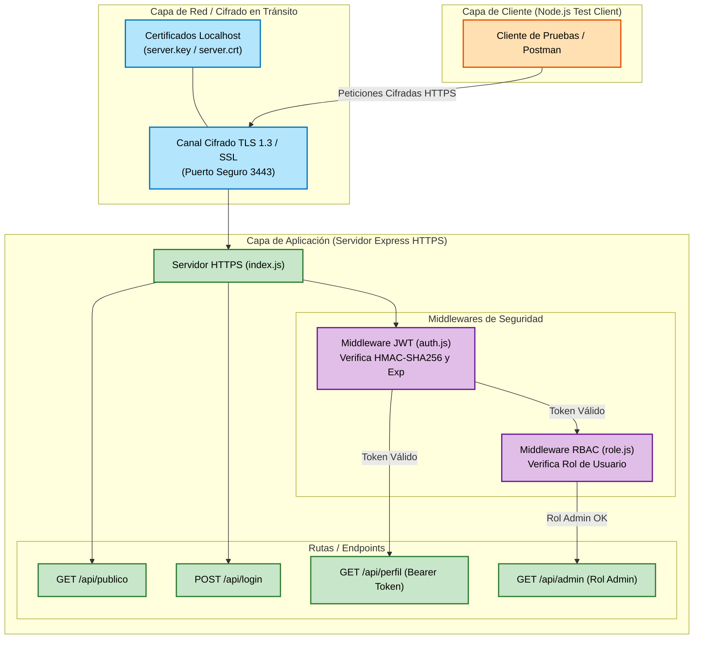

```mermaid
flowchart TD
    subgraph Capa_Cliente ["Capa de Cliente (Node.js Test Client)"]
        Cliente["Cliente de Pruebas / Postman"]
    end

    subgraph Capa_Seguridad_Transito ["Capa de Red / Cifrado en Tránsito"]
        TLS["Canal Cifrado TLS 1.3 / SSL<br/>(Puerto Seguro 3443)"]
        Certs["Certificados Localhost<br/>(server.key / server.crt)"]
        Certs --- TLS
    end

    subgraph Capa_Servidor ["Capa de Aplicación (Servidor Express HTTPS)"]
        HTTPS_Server["Servidor HTTPS (index.js)"]
        
        subgraph Middlewares_Seguridad ["Middlewares de Seguridad"]
            Auth_MW["Middleware JWT (auth.js)<br/>Verifica HMAC-SHA256 y Exp"]
            Role_MW["Middleware RBAC (role.js)<br/>Verifica Rol de Usuario"]
        end

        subgraph Endpoints_Protegidos ["Rutas / Endpoints"]
            Publico["GET /api/publico"]
            Login["POST /api/login"]
            Perfil["GET /api/perfil (Bearer Token)"]
            Admin["GET /api/admin (Rol Admin)"]
        end
    end

    %% Conexiones
    Cliente -- "Peticiones Cifradas HTTPS" --> TLS
    TLS --> HTTPS_Server

    HTTPS_Server --> Login
    HTTPS_Server --> Publico
    HTTPS_Server --> Auth_MW

    Auth_MW -- "Token Válido" --> Perfil
    Auth_MW -- "Token Válido" --> Role_MW
    Role_MW -- "Rol Admin OK" --> Admin

    %% Estilos con texto negro explícito (legible en Dark y Light mode)
    classDef clientStyle fill:#FFE0B2,stroke:#E65100,stroke-width:2px,color:#000000;
    classDef tlsStyle fill:#B3E5FC,stroke:#0277BD,stroke-width:2px,color:#000000;
    classDef appStyle fill:#C8E6C9,stroke:#2E7D32,stroke-width:2px,color:#000000;
    classDef mwStyle fill:#E1BEE7,stroke:#6A1B9A,stroke-width:2px,color:#000000;

    class Cliente clientStyle;
    class TLS,Certs tlsStyle;
    class HTTPS_Server,Publico,Login,Perfil,Admin appStyle;
    class Auth_MW,Role_MW mwStyle;
```